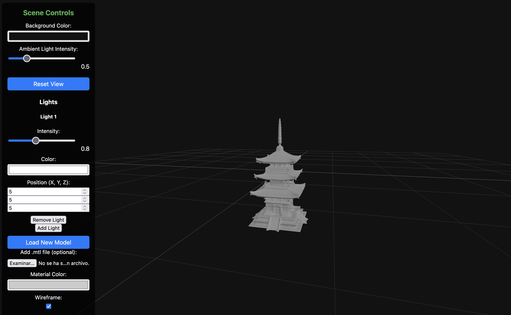

# PromptSculptStudio

This is a work-in-progress learning project for creating and visualizing 3D objects.



## Capabilities:
- Load and display `.obj` 3D models.
- Apply `.mtl` materials to models (if provided).
- Customize background color.
- Adjust ambient light intensity.
- Add and manage multiple directional lights with adjustable intensity, color, and position.
- Change material color for models without `.mtl` files.
- Toggle wireframe mode.
- Reset the view to the initial camera position.
- Display model information (vertices and faces).


## Getting Started:
To run this application, first install the dependencies:
```bash
pnpm install
```
Then, start the development server:
```bash
pnpm dev
```